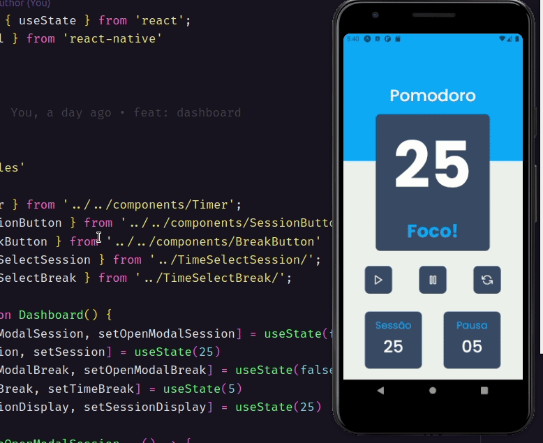

<h1 align="center">
    
</h1>

## **SOBRE**
Este App tem como objetivo a utilização da técnica Pomodoro.


Se você não conhece, está técnica baseia-se em uma sequencia de tempo 

alternada entre foco e depois descanso.


Normalmente 25 minutos de foco e depois 5 minutos de descanso.


Porém neste app a função foi criada somente em segundos.

Após o final do ciclo de foco o celular irá vibrar uma vez

após o final do clico de descanso o celular irá vibrar duas vezes.

---

### **TECNOLOGIAS UTILIZADAS**
- ReactNative
- TypeScript
- Styled Components
- Expo with Bare Workflow

---

### **COMO RODAR O PROJETO**

Antes de tudo, este projeto foi criado utilizando o Expo,

portanto caso você não o tenha instalado em sua máquina, primeiramente você

deverá acessar este link: [Expo installation](https://docs.expo.dev/get-started/installation/)

É rápido e bem simples.

## Faça o clone do repositório e acesse a pasta ##
```
git clone git@github.com:alexandremolive/pomodoro-reactnative.git
cd pomodoro-reactnative

```

## Execute os comandos abaixo para instalar as dependencias ##

```
yarn add
ou
npm install
```
## Depois é só iniciar o projeto ##
```
expo start
```